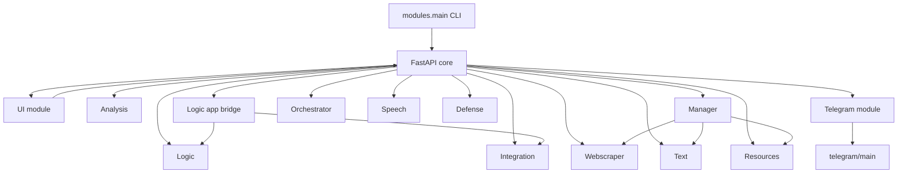

# System audit and modernisation plan

## Module map
| Module/Service | Purpose | Entry point(s) | Key dependencies | Python target | Surface |
| --- | --- | --- | --- | --- | --- |
| CLI / service runner | Orchestrates dependency checks, virtualenv creation, and service dispatch (API, Telegram, combined, module introspection).【F:modules/main.py†L1-L198】 | `modules/main.py` (invoked via `python -m coman.modules.main`).【F:modules/main.py†L1-L198】 | `fastapi`, `pydantic`, `apscheduler`, `httpx`, `python-telegram-bot`, subprocess/venv helpers.【F:modules/main.py†L25-L170】 | 3.10+ (documented project baseline).【F:README.md†L21-L36】 | CLI and service bootstrap.【F:modules/main.py†L135-L172】 |
| Core FastAPI app | Builds the FastAPI application, wires scheduler lifecycle, exposes health endpoint, mounts UI, and includes module routers.【F:core/app.py†L1-L35】 | `core/app.py`, `core/registry.py` (dynamic module loading).【F:core/app.py†L1-L35】【F:core/registry.py†L1-L24】 | FastAPI (vendored), scheduler wrapper, module routers.【F:core/app.py†L1-L35】 | 3.10+.【F:README.md†L21-L24】 | HTTP REST.【F:core/app.py†L21-L34】 |
| UI module | Declares module shim and mounts HTML-driven views that call other modules via HTTP clients.【F:modules/ui/module.py†L1-L7】【F:modules/ui/mount.py†L17-L157】 | `modules/ui/module.py`, `modules/ui/mount.py`.【F:modules/ui/module.py†L1-L7】【F:modules/ui/mount.py†L17-L157】 | FastAPI templating, `httpx`, `jinja2`, redirect helpers.【F:modules/ui/mount.py†L3-L155】 | 3.10+.【F:README.md†L21-L24】 | HTTP (HTML pages).【F:modules/ui/mount.py†L20-L155】 |
| Analysis module | Word frequency endpoint for basic text analytics.【F:modules/analysis_module/module.py†L1-L11】 | `modules/analysis_module/module.py`.【F:modules/analysis_module/module.py†L1-L11】 | FastAPI router, `collections.Counter`.【F:modules/analysis_module/module.py†L1-L11】 | 3.10+.【F:README.md†L21-L24】 | HTTP.【F:modules/analysis_module/module.py†L7-L11】 |
| Logic module | SQLite-backed fact/rule storage and inference DSL endpoints.【F:modules/logic_module/module.py†L1-L39】【F:modules/logic_module/db.py†L1-L17】 | `modules/logic_module/module.py`, `modules/logic_module/db.py`.【F:modules/logic_module/module.py†L1-L39】【F:modules/logic_module/db.py†L1-L17】 | SQLite (`sqlite3`), FastAPI router, local DB helper.【F:modules/logic_module/module.py†L1-L39】【F:modules/logic_module/db.py†L1-L17】 | 3.10+.【F:README.md†L21-L24】 | HTTP.【F:modules/logic_module/module.py†L7-L39】 |
| Logic app bridge | Evaluates JSON rule DSL and dispatches integration calls via HTTP.【F:modules/logic_app/module.py†L1-L45】 | `modules/logic_app/module.py`.【F:modules/logic_app/module.py†L1-L45】 | `httpx`, `json`, FastAPI `HTTPException`, core settings.【F:modules/logic_app/module.py†L1-L45】 | 3.10+.【F:README.md†L21-L24】 | HTTP.【F:modules/logic_app/module.py†L21-L45】 |
| Manager module | Tool registry CRUD and heuristic task router calling other API endpoints.【F:modules/manager/module.py†L1-L148】 | `modules/manager/module.py`.【F:modules/manager/module.py†L1-L148】 | FastAPI params, `httpx`, JSON heuristics, core message models.【F:modules/manager/module.py†L12-L147】 | 3.10+.【F:README.md†L21-L24】 | HTTP + internal CLI hooks.【F:modules/manager/module.py†L51-L147】 |
| Integration module | Registers external callables and executes them in-process or via subprocess runner with signature verification.【F:modules/integration/module.py†L1-L154】 | `modules/integration/module.py`, `modules/integration/runner.py`.【F:modules/integration/module.py†L1-L154】 | FastAPI `HTTPException`, filesystem access, subprocess, `importlib`, hashing utilities.【F:modules/integration/module.py†L12-L153】 | 3.10+.【F:README.md†L21-L24】 | HTTP + subprocess CLI runner.【F:modules/integration/module.py†L62-L148】 |
| Orchestrator module | Capability registry and extension loader for LLM workflows.【F:modules/orchestrator/module.py†L1-L66】 | `modules/orchestrator/module.py`.【F:modules/orchestrator/module.py†L1-L66】 | FastAPI, JSON, filesystem globbing.【F:modules/orchestrator/module.py†L4-L65】 | 3.10+.【F:README.md†L21-L24】 | HTTP.【F:modules/orchestrator/module.py†L33-L66】 |
| Resource module | Captures CPU and memory snapshots via `psutil`.【F:modules/resource_manager/module.py†L1-L11】 | `modules/resource_manager/module.py`.【F:modules/resource_manager/module.py†L1-L11】 | `psutil`.【F:modules/resource_manager/module.py†L3-L11】 | 3.10+.【F:README.md†L21-L24】 | HTTP.【F:modules/resource_manager/module.py†L8-L11】 |
| Text module | Provides uppercase text utility endpoint.【F:modules/text_module/module.py†L1-L10】 | `modules/text_module/module.py`.【F:modules/text_module/module.py†L1-L10】 | FastAPI `Query`.【F:modules/text_module/module.py†L1-L10】 | 3.10+.【F:README.md†L21-L24】 | HTTP.【F:modules/text_module/module.py†L8-L10】 |
| Speech module | Uses OpenAI SDK for TTS/STT when configured, streaming audio responses.【F:modules/speech_module/module.py†L1-L41】 | `modules/speech_module/module.py`.【F:modules/speech_module/module.py†L1-L41】 | FastAPI upload responses, `openai`, `io`.【F:modules/speech_module/module.py†L4-L40】 | 3.10+.【F:README.md†L21-L24】 | HTTP.【F:modules/speech_module/module.py†L11-L40】 |
| Webscraper module | Fetches remote HTML and parses titles with BeautifulSoup.【F:modules/webscraper_module/module.py†L1-L14】 | `modules/webscraper_module/module.py`.【F:modules/webscraper_module/module.py†L1-L14】 | `httpx`, `bs4`.【F:modules/webscraper_module/module.py†L3-L13】 | 3.10+.【F:README.md†L21-L24】 | HTTP.【F:modules/webscraper_module/module.py†L9-L13】 |
| Defense system module | Security helpers for vulnerability lookup and nmap execution.【F:modules/defense_system/module.py†L1-L32】 | `modules/defense_system/module.py`.【F:modules/defense_system/module.py†L1-L32】 | FastAPI `HTTPException`, `subprocess`, JSON datasets.【F:modules/defense_system/module.py†L4-L31】 | 3.10+.【F:README.md†L21-L24】 | HTTP.【F:modules/defense_system/module.py†L16-L31】 |
| Telegram module | FastAPI control plane for Telegram bot lifecycle, threads, and token storage.【F:modules/telegram_module/module.py†L1-L99】 | `modules/telegram_module/module.py`.【F:modules/telegram_module/module.py†L1-L99】 | FastAPI `Body`, threading, async loop, `python-telegram-bot` shims.【F:modules/telegram_module/module.py†L8-L98】 | 3.10+.【F:README.md†L21-L24】 | HTTP + background worker.【F:modules/telegram_module/module.py†L26-L98】 |
| Telegram standalone runner | Legacy entry point delegating to unified CLI for bot startup.【F:telegram/main.py†L1-L12】 | `telegram/main.py`.【F:telegram/main.py†L1-L12】 | Depends on CLI runner. | 3.10+.【F:telegram/README.md†L10-L18】 | CLI.【F:telegram/main.py†L8-L12】 |
| Vendored FastAPI shim | Fallback FastAPI implementation used when real dependency is absent; masks upstream package by default.【F:fastapi/__init__.py†L1-L138】 | `fastapi/__init__.py`, supporting stubs under `fastapi/`.【F:fastapi/__init__.py†L1-L138】 | Custom loader, lightweight routers/responses/test client.【F:fastapi/__init__.py†L90-L138】【F:fastapi/testclient.py†L1-L36】 | 3.10+. | HTTP stub surface.【F:fastapi/app.py†L1-L200】 |
| Vendored Pydantic shim | Minimal BaseModel emulation when real Pydantic is unavailable.【F:pydantic/__init__.py†L1-L191】 | `pydantic/__init__.py`.【F:pydantic/__init__.py†L1-L191】 | Custom BaseModel, Field, ValidationError replacements.【F:pydantic/__init__.py†L84-L190】 | 3.10+. | Data modelling shim.【F:pydantic/__init__.py†L84-L190】 |

## Dependency graph

## Dependency risk list
- **Requests/python-dotenv/apscheduler unpinned above major versions** – only lower bounds are declared, so future upstream releases could introduce breaking changes without warning.【F:modules/requirements.txt†L6-L8】
- **Telegram-only requirements duplicate loosened pins** – the standalone Telegram requirements repeat the unbounded Requests/python-dotenv constraints, increasing drift risk.【F:telegram/requirements.txt†L1-L3】
- **Missing dependency declarations** – several modules import packages absent from shared requirements: `psutil` (resources), `bs4` (webscraper), and `openai` (speech).【F:modules/resource_manager/module.py†L3-L11】【F:modules/webscraper_module/module.py†L3-L13】【F:modules/speech_module/module.py†L14-L40】【F:modules/requirements.txt†L1-L8】
- **Vendored FastAPI/Pydantic shims** mask real packages and lag upstream features, leading to API mismatches (e.g., missing form parsing).【F:fastapi/__init__.py†L1-L138】【F:pydantic/__init__.py†L1-L191】
- **External tool coupling** – defense module shells out to `nmap` without dependency checks, which can fail silently or hang in production environments.【F:modules/defense_system/module.py†L23-L27】

## Modernisation approach options
1. **Replace vendored shims with real dependencies managed via `uv` and enforce pinned versions.** Pros: aligns with upstream APIs, unlocks FastAPI/Pydantic features, simplifies maintenance. Cons: increases install footprint and requires CI/tooling updates.
2. **Harden the existing shims and continue to avoid external dependencies.** Pros: zero additional runtime dependencies. Cons: perpetual catch-up work, diverging behaviour, harder to support third-party integrations.

**Chosen option:** *Option 1* — aligning with supported FastAPI/Pydantic releases is essential for Python 3.12 compatibility, observability (OpenTelemetry), and reducing maintenance burden; the dependency overhead is justified by increased correctness and tooling support.

## Delta plan by module
### CLI / service runner
- **Modify:** `modules/main.py` to target Python 3.12+, switch environment management to `uv`, add Ruff/mypy hooks, and ensure dependency checks rely on pinned versions (no dynamic import probing).【F:modules/main.py†L1-L170】
- **Create:** `pyproject.toml` / `uv.lock` entries for command aliases and dependency metadata.
- **Delete:** Legacy virtualenv helpers once `uv` workflows are documented.

### Core FastAPI app
- **Modify:** `core/app.py`, `core/registry.py`, `core/scheduler.py` to use real FastAPI lifespan hooks, structured logging, and OpenTelemetry instrumentation under Python 3.12 typing.【F:core/app.py†L1-L35】【F:core/registry.py†L1-L24】【F:core/scheduler.py†L1-L36】
- **Delete:** Vendored `fastapi/` stub after confirming external dependency usage.【F:fastapi/__init__.py†L1-L138】
- **Modify:** `core/messages/*` to rely on Pydantic v2 features only (remove compatibility fallbacks).【F:core/messages/base.py†L1-L62】

### UI module
- **Modify:** `modules/ui/mount.py` to adopt dependency-injected clients, async handlers, and templating configuration compatible with FastAPI 0.115+/Starlette 0.37 on Python 3.12.【F:modules/ui/mount.py†L17-L155】
- **Modify:** `modules/ui/module.py` to expose router factory rather than global registration for easier testing.【F:modules/ui/module.py†L1-L7】

### Analysis module
- **Modify:** `modules/analysis_module/module.py` to add request/response models (Pydantic v2) and typing updates.【F:modules/analysis_module/module.py†L1-L11】

### Logic module
- **Modify:** `modules/logic_module/module.py`, `modules/logic_module/db.py` to enforce async DB access or background tasks compatible with FastAPI async stack, add models, and ensure sqlite paths handle Python 3.12 path typing.【F:modules/logic_module/module.py†L1-L39】【F:modules/logic_module/db.py†L1-L17】

### Logic app bridge
- **Modify:** `modules/logic_app/module.py` to move blocking HTTP calls to async clients, define Pydantic v2 schemas, and harden error handling.【F:modules/logic_app/module.py†L1-L45】

### Manager module
- **Modify:** `modules/manager/module.py` to introduce typed request/response models, async `httpx.AsyncClient`, and OpenTelemetry spans around external calls.【F:modules/manager/module.py†L1-L147】
- **Create:** Shared service client helper in `core` or `modules/common` to consolidate API calls.

### Integration module
- **Modify:** `modules/integration/module.py` to validate payloads with Pydantic v2, replace subprocess JSON protocol with typed dataclasses, and ensure sandboxing for Python 3.12 (e.g., `venv` isolation).【F:modules/integration/module.py†L1-L153】
- **Modify:** `modules/integration/runner.py` accordingly.

### Orchestrator module
- **Modify:** `modules/orchestrator/module.py` to adopt typed capability models (Pydantic v2) and async filesystem interactions where needed.【F:modules/orchestrator/module.py†L1-L65】

### Resource module
- **Modify:** `modules/resource_manager/module.py` to dependency-inject `psutil` usage, add graceful fallbacks, and declare requirement in shared manifest.【F:modules/resource_manager/module.py†L1-L11】

### Text module
- **Modify:** `modules/text_module/module.py` to include Pydantic response models and parameter validation aligned with FastAPI 0.115+.【F:modules/text_module/module.py†L1-L10】

### Speech module
- **Modify:** `modules/speech_module/module.py` to async-stream audio, wrap OpenAI client config via dependency injection, and register telemetry spans.【F:modules/speech_module/module.py†L1-L40】
- **Create:** Settings schema for OpenAI credentials managed via Pydantic v2.

### Webscraper module
- **Modify:** `modules/webscraper_module/module.py` to move to async HTTP client with timeout/retry policies and add HTML parsing guards; ensure `beautifulsoup4` is declared/pinned.【F:modules/webscraper_module/module.py†L1-L13】

### Defense system module
- **Modify:** `modules/defense_system/module.py` to sandbox subprocess execution, add async wrappers, and expose structured responses with Pydantic v2 models.【F:modules/defense_system/module.py†L1-L31】

### Telegram module & runner
- **Modify:** `modules/telegram_module/module.py` to decouple threading from FastAPI process, expose async startup hooks, and align token storage with Pydantic settings.【F:modules/telegram_module/module.py†L1-L98】
- **Modify:** `telegram/main.py` (and supporting package) to rely on shared telemetry/logging stack.【F:telegram/main.py†L1-L12】
- **Modify:** `telegram/requirements.txt` to pin dependencies consistently with main requirements.【F:telegram/requirements.txt†L1-L3】

### Vendored shims
- **Delete:** `fastapi/` and `pydantic/` directories once external dependencies are enforced.【F:fastapi/__init__.py†L1-L138】【F:pydantic/__init__.py†L1-L191】
- **Modify:** Tests under `tests/` to consume real FastAPI/Pydantic APIs and update fixtures accordingly.【F:tests/test_fastapi_stub.py†L1-L200】

## Planned PR sequence (≤300 LOC each)
- [ ] **PR1 – Tooling foundation:** add `pyproject.toml`, configure `uv`, Ruff, mypy, pytest, and pin shared dependencies (including `psutil`, `beautifulsoup4`, `openai`).
- [ ] **PR2 – Replace vendored shims:** remove `fastapi/` and `pydantic/` stubs, require real packages, adapt core tests to official APIs, introduce OpenTelemetry scaffolding.
- [ ] **PR3 – Core + shared models:** refactor `core/app.py`, `core/messages`, scheduler, and shared clients for async/typed interactions under Python 3.12.
- [ ] **PR4 – Feature modules batch 1:** migrate analysis, text, resources, webscraper, and defense modules to async FastAPI patterns with Pydantic v2 models.
- [ ] **PR5 – Feature modules batch 2:** modernise manager, logic, logic_app, orchestrator, and integration modules; introduce shared service clients and improved persistence.
- [ ] **PR6 – UI & speech/telegram:** update UI templating, speech OpenAI integration, and Telegram module/runner with telemetry and async lifecycles.
